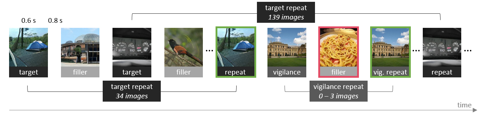

# Memory Game
This is my latest implementation of the memory game used to collect (human) memorability scores for large sets of images,
as first proposed by Isola et al. (2011) in [this paper](http://web.mit.edu/phillipi/www/publications/WhatMakesAnImageMemorable.pdf).

It's very much based on the code we used for [GANalyze](http://ganalyze.csail.mit.edu) and [MemCat](http://gestaltrevision.be/projects/memcat/). 
However, I did some considerable improving, cleaning, and reorganizing and can no longer guarantee that it works 100% the same.

Please test it thoroughly before using it for your own memory studies.


## Overview
- [Testing locally](#testing-locally)
- [Going online](#going-online)
- [AMT](#amt)
- [Customize](#customize)
- [Acknowledgements](#acknowledgements)
- [Reference](#reference)

## Testing locally
A first thing you might want to try is to run the game locally. What follows is an example of how to do that with
the [MemCat](http://gestaltrevision.be/projects/memcat/) images.<sup>1</sup>

First clone the repo.
```bash
git clone https://github.com/LoreGoetschalckx/MemoryGame.git
cd MemoryGame
```

<sup>1</sup><sub><sup>*Note*: The current version of the code presents all the images in the same size and aspect ratio (square). This wasn't the case
in the original [MemCat](http://gestaltrevision.be/projects/memcat/) study. If you want to change this behavior, you will
have to adjust [this](/memorygame/index.html) file and possibly [this](/memorygame/assets/js/main.js) one too.</sup></sub>

### Adding images
The commands below will download the [MemCat](http://gestaltrevision.be/projects/memcat/) image set and reorganize it into the
right folder structure. If you're using your own image set, it's easiest if you organize it in the same way.

```bash
cd stimuli
python download_memcat.py
cd ..
```

Do your images come in sets of which you want to show no more than one image per participant? For example, in the [GANalyze](http://ganalyze.csail.mit.edu) 
study, we had multiple modified clone images of the same seed image and wanted to make sure a single participant would never see more than one.
For this **clustering**, you will have to add one level of nesting in the folder structure. Make sure images belonging to the same set or cluster or placed in the same sub-folder.
```
stimuli
|---your_image_set
|   |---targets
|   |   |---one_cluster
|   |   |   |   *.jpg
|   |   |---another_cluster
|   |   |   |   *.jpg
|   |---fillers
|   |   |---one_cluster
|   |   |   |   *.jpg
|   |   |---another_cluster
|   |   |   |   *.jpg

```  

### Pregenerating game tracks
Every participant will be assigned a game "track". A track consists of multiple sequences of images. One sequence is similar to a block
(or sometimes I call it a "run"). Images are never repeated across sequences. When a participant completes a sequence, they can 
continue with the next one in their track, or return to the game at a later time. The game remembers which track a participant was assigned
and where (i.e, which sequence) they left off.

Each game track is fully described and defined by a .json file, called a sequenceFile here. The sequenceFiles, unfortunately,
are not created on the fly but need to be pregenerated.

#### Generating
Run this to pregenerate sequenceFiles. 
You will want to make sure that you have at least as many as you expect to have participants. Set --num_workers high enough (10 is just an example, too low).
```bash
cd sequences
python initializeWorkerSequences.py --num_workers=10
```


If you plan on using Amazon Mechanical Turk (AMT), you will need an extra track for the preview. It's a dummy track with images
you don't use in the real game, so that AMT workers can try the game before accepting the HIT.
```bash
python initializeWorkerSequences.py --target_dir=preview --filler_dir=preview --preview=True
```
You should now see a file named previewSequence.json in [this](/sequences/sequenceFiles) folder.

#### Checking
You can visualize and explore the tracks to see if they match your expectations.

```bash
cd stimuli/memcat
python -m http.server 8000
```

Open a second shell, navigate to the MemoryGame folder and run:
```bash
cd sequences
python -m http.server 7000
```

Then go to [http://localhost:7000/](http://localhost:7000/) in your browser and explore the tracks.
Kill the http servers when you're done.

You can also run the commands below and check the repeat_probabilities.png file it produces.
```bash
cd sequences
python inspectSequenceDiagnostics.py
```

### Playing the game!
To play the game locally, you'll have to serve the images, the front-end of the game, as well as run the server.py
script to take care of back-end tasks, like assigning participants to a track, blocking participants if they've completed
the maximum number of sequences or failed the vigilance performance criterion, etc.

Open 3 shells and run:
```bash
cd stinuli/memcat
python -m http.server 8000
```

```bash
cd server
python server.py
```

```bash
cd memorygame
python -m http.server 7000
```

Then go to [http://localhost:7000/](http://localhost:7000/) in your browser. You should see a page with instructions.

### Look at the data
Data will be stored after every sequence, even if the submit button hasn't been clicked yet. The submit button is just a
way for participants to let you know that they're done playing for now and that they'd like to be compensated for the number
of sequences they've just completed.

Have a look at the following data files:
- [data.csv](/data/data.csv): This is the raw data you will want to analyze. One line is one trial.
- [data_sandbox.csv](/data/data_sandbox.csv): If you are running the game from within AMT's sandbox, the data will be stored here.
- [assignedSequences.csv](/data/assignedSequences.csv): This is used to keep track of who has been assigned which track,
what their next sequence will be, whether they've been blocked, etc.
- [submittedRuns.csv](/data/submittedRuns.csv): When a participant clicks submit, it will add a line to this file,
so you can keep track of who needs to be compensated. A participant can return to the game later and submit more sequences,
so it's possible they have more than one line in this file.
- [dashboard.json](/data/dashboard.json). A rough indication of how many sequences have been completed and how many passed
the vigilance performance criterion. It's only rough because it will likely include your test runs and debug runs too.

## Going online
Once you've thoroughly tested the game locally, you can start testing it online. You will need a python server for the backend
and a webserver for the frontend. If you don't have any, I can recommend [PythonAnywhere](https://eu.pythonanywhere.com/)
(there is also an [EU](https://eu.pythonanywhere.com/) version).

Adjust the serverURL and the baseURL settings in [this config.json](memorygame/config.json) and
[this config.json](sequences/exploreSequences/config.json) accordingly.

You will then have an URL for your game that you can share with participants directly or you can embed it in AMT.

One thing you might want to test, is if participants finishing a sequence around the same time won't overwrite each other's
data. The filelocks in the [server.py](server/server.py) are meant to prevent that, but better to be sure. 

## AMT
If you'd like to recruit participants through AMT, you will want to embed the game as an iframe inside the AMT page. 
Check [Anelise Newman's awesome notebook](https://github.com/a-newman/mturk-api-notebook/blob/master/mturk_external_link.ipynb) for pointers on how to do that.

The [main.js](memorygame/assets/js/main.js) should automatically recognize when a participant is participating through
AMT and it will handle the required adjustments (e.g., read the instructions from
[instructions_mturk.js](memorygame/instructions_mturk.json) instead of [instructions.js](memorygame/instructions.json),
detect the workerId automatically rather than having them type their participationId, adjust the submission behavior, etc.).

Please test it thoroughly in the AMT sandbox first.

*Note* that way it is set up, you will need to set the standard reward for a HIT to the compensation for 1 sequence. If 
a worker completes more than one sequence within a single HIT, they can be paid for those additional sequences through a 
bonus. The game will send information on how much bonus a worker should receive to the AMT server. It's then up to you
as the requester to extract that information and assign the right bonus. Check the
[Boto3 Documentation](https://boto3.amazonaws.com/v1/documentation/api/latest/reference/services/mturk.html). 

## Customize
If you'd like to change some aspects of the game, the first places to check are:
- [the front-end config](memorygame/config.json)
- [the back-end config](server/server_config.json)
- [instructions.json](memorygame/instructions.json)
- [instructions_mturk.json](memorygame/instructions_mturk.json)

Also have a look a the different arguments that can be passed to [initializeWorkerSequences.py](sequences/initializeWorkerSequences.py).

*Note* Please always test it thoroughly to be sure that the changes you make have the desired effect.

## Acknowledgements
- [Anelise Newman's AMT api notebook](https://github.com/a-newman/mturk-api-notebook)
- [Anelise Newman's AMT AMT template](https://github.com/a-newman/mturk-api-notebook)
- [MemCat](http://gestaltrevision.be/projects/memcat/). Some elements of this repo were inspired by the code we used for MemCat. Rudy Dekeerschieter and Christophe Bossens contributed to that code.
- [LaMem](http://memorability.csail.mit.edu/index.html)
- [Isola et al. (2011)](http://web.mit.edu/phillipi/www/publications/WhatMakesAnImageMemorable.pdf)

## Reference 
This implementation of the memory game is a reworked version of the one used for the [GANalyze paper](http://ganalyze.csail.mit.edu/).
If you use this code or work, please cite:

Goetschalckx, L., Andonian, A., Oliva, A., & Isola, P. (2019). GANalyze: Toward visual definitions of cognitive image properties. IEEE International Conference on Computer Vision, 5744-5753.

The following is a BibTeX reference entry:

```markdown
@InProceedings{Goetschalckx_2019_ICCV,
author = {Goetschalckx, Lore and Andonian, Alex and Oliva, Aude and Isola, Phillip},
title = {GANalyze: Toward Visual Definitions of Cognitive Image Properties},
booktitle = {Proceedings of the IEEE/CVF International Conference on Computer Vision (ICCV)},
month = {October},
year = {2019}
}
```
